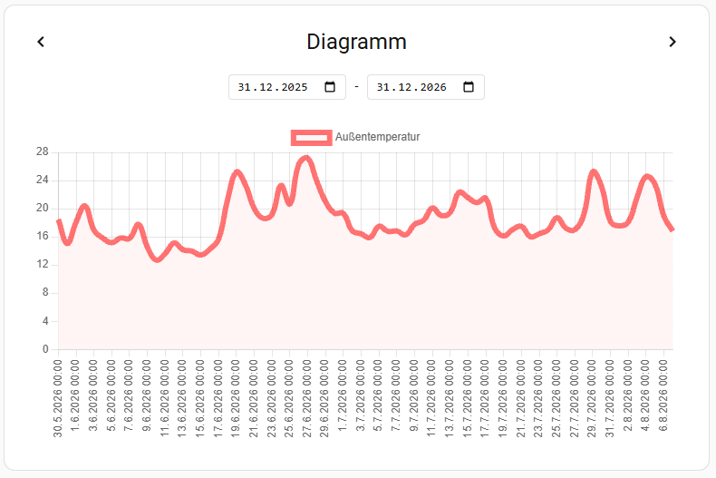
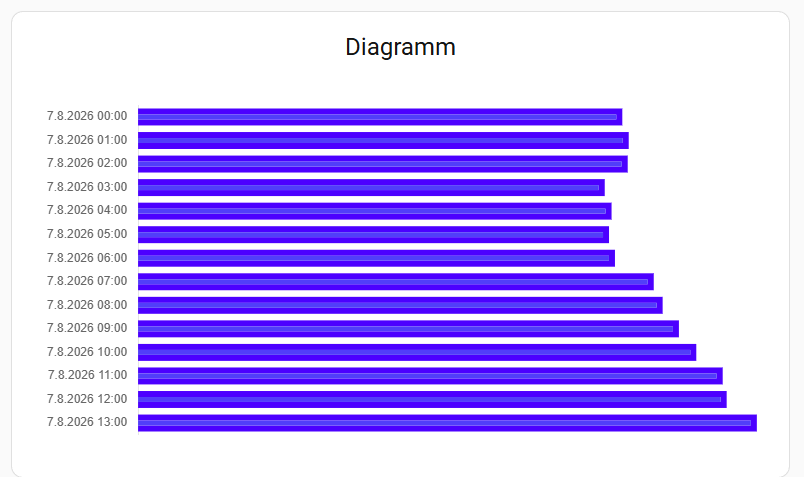
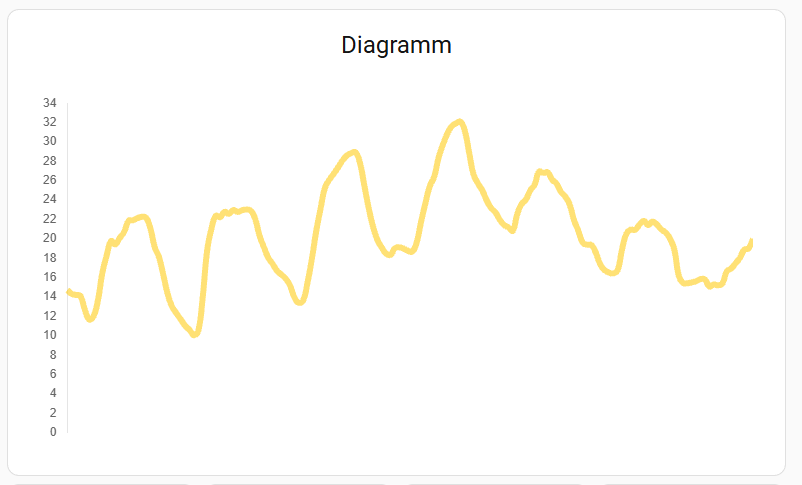

# Fixed Period Chart for Home Assistant

A custom Lovelace card for Home Assistant that displays historical data (states/attributes) over a fixed, customizable time period using Chart.js.

## Screenshots

  
  

  

## Features

- **Fixed Time Periods:** Choose between days, weeks, months, or years.
- **Dynamic Time Navigation:** Provides forward/backward arrows to seamlessly jump between historical periods (e.g., jump from last month to this month).
- **Custom Periods:** Define custom start and end dates via Home Assistant Entities (`input_datetime` or `input_select`).
- **Visual Editor Support:** Full support for the Home Assistant UI Visual Editor. No YAML editing required (unless you want to).
- **Multi-Entity Support:** Combine multiple sensors into a single chart.
- **Customizable Appearance:**
  - Support for Line, Bar, and Scatter charts.
  - Fully customizable line styles (Solid, Dashed, Dotted), line smoothing, and data point visibility.
  - Custom colors and transparency (opacity) with visual color picker.
  - Configurable animations (Linear, Ease Out, Bounce, Elastic).
  - Hide/Show X/Y Axes, Grid Lines, Legend, and Tooltips.
- **Dynamic Entities:** Use Home Assistant helpers (e.g. `input_text`, `input_number`) to dynamically change colors and line widths from your dashboard without editing the card configuration.

## Installation

### Via HACS (Home Assistant Community Store)
*Note: As this is a beta release, you may need to add this repository as a custom repository in HACS.*

1. Go to HACS -> Frontend.
2. Click the three dots in the top right corner and select **Custom repositories**.
3. Add the URL of this GitHub repository and select **Lovelace** as the category.
4. Click Add.
5. You should now see "Fixed Period Chart" in your HACS frontend list. Click it and select **Download**.
6. Refresh your Home Assistant browser window.

## Usage & Configuration

Once installed, you can add the card via the visual Lovelace editor by searching for **Fixed Period Chart**.

The Visual Editor is split into 5 intuitive sections:
1. **Entities & Period:** Add your sensors, define their names, chart types (Bar/Line/Scatter), colors, and line widths. Choose the time period (Day, Week, Month, Year, Custom).
2. **Time & Resolution:** Define how granular the data should be (e.g., group by hour or day) and which function to use (average, min, max, sum).
3. **Appearance:** Set global colors (like the card background).
4. **Display & Axes:** Toggle visibility of the legend, tooltips, axes, grid lines, and choose your animation easing effect.

### Custom Period & Resolution Control
If you select **Custom** as your period (or want to control resolution dynamically), you can use Home Assistant helpers (`input_select`) to control the chart from your dashboard.

**Period Entity (`input_select`):**
If you map a Period Entity, your `input_select` options must use the following exact internal string values (you can use translations/friendly names in the UI, but the underlying state must be one of these):
- `today`
- `yesterday`
- `this_week`
- `last_week`
- `this_month`
- `last_month`
- `this_year`
- `last_year`

**Resolution Entity (`input_select`):**
If you want to let users change the resolution dynamically (e.g. from daily to monthly bars), the underlying state must be one of:
- `hour`
- `day`
- `month`
- `year`

**Start / End Entity (`input_datetime`):**
- Map an `input_datetime` helper to dynamically set the exact start and end dates. These take precedence over the Period Entity.

## Development Workflow

If you want to contribute, add features, or fix bugs, it is highly recommended to develop locally:
1. Install Git and clone this repository into your Home Assistant's `www` or `hacsfiles` folder.
2. Run `npm install` to install dependencies.
3. Use `npm run dev` to automatically compile `src/fixed-period-chart.js` into `dist/fixed-period-chart.js` whenever you make changes.
4. Test your changes directly in your local Home Assistant instance. *(Note for developers: Since you are bypassing HACS during local development, remember to manually clear your cache or add `?v=xxx` to your resource URL to see your code changes).*
5. Once your changes are stable, commit and push them to GitHub.

## Open Source Credits & Licenses

This project relies on the following incredible open-source libraries:
- **[Chart.js](https://www.chartjs.org/)** - Licensed under the MIT License. Used for rendering the high-performance HTML5 canvas charts.
- **[Lit](https://lit.dev/)** - Licensed under the BSD-3-Clause License. Used for building the fast, lightweight web components and the visual editor interface.

## License

This project is licensed under the MIT License - see the [LICENSE](LICENSE) file for details.
